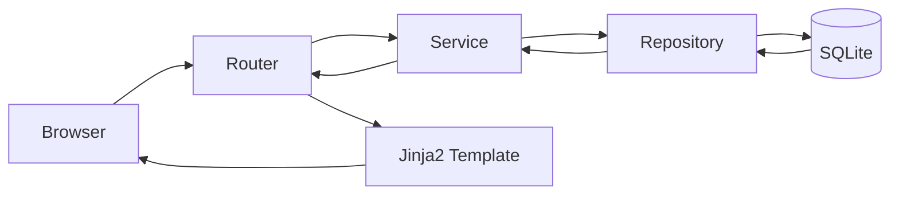
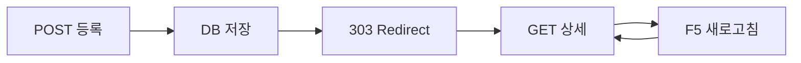

# B5-2 Round 01 — Beginner Guide

구분: **선택 미션 (OPTIONAL)**  
현재 모드: **Phase A — REFERENCE BUILD / PRE-RUNTIME AUDIT**

> 지금은 기준 구현·학습자료·검증계획을 먼저 준비합니다. 브라우저/DB 실제 실행 결과는 Phase C에서 사용자가 한 단계씩 검증하며 Evidence로 확정합니다.

## 🚀 빠른 시작(Quick Start)

### 처음 시작하는 경우

1. [`START-CHECK.md`](START-CHECK.md)에서 선행 지식을 확인합니다.
2. 현재 실행 환경(Current Runtime Context)을 정합니다.
   - 학교 Mac → **MAC-V**: OrbStack → Ubuntu 24.04
   - 개인 Win11 → **WIN-V**: WSL2 → Ubuntu 24.04
3. 저장소와 Python 상태를 먼저 확인합니다.

```bash
pwd
git status --short
python3 --version
```

정상 기준:

```text
[ ] B5-2 저장소 안에 있다.
[ ] 예상하지 않은 Git 변경이 없다.
[ ] Python 3.10 이상이다.
```

4. `training/round-01-clear/reference`에서 가상환경을 준비합니다.

```bash
cd training/round-01-clear/reference
python3 -m venv .venv
source .venv/bin/activate
python -m pip install -r requirements.txt
```

5. Round 디렉터리에서 실행 전 검증(Verification)을 수행합니다.

```bash
cd ..
bash environment/verify.sh
```

6. `0 FAIL`을 확인한 뒤에만 서버 실행 단계로 이동합니다. 이 검증은 실제 브라우저 Runtime을 대신하지 않습니다.

### 이미 환경을 준비했고 다시 이어서 하는 경우

```bash
cd training/round-01-clear/reference
source .venv/bin/activate
cd ..
bash environment/verify.sh
```

```text
✅ GO
→ Result: N PASS / 0 FAIL
→ reference/로 이동
→ uvicorn app.main:app --reload
→ 실제 CRUD/PRG/SQLite/Not Found 검증

❌ STOP
→ FAIL 항목부터 해결
→ 실패 상태에서 Runtime PASS 또는 CLEAR 기록 금지
```

> Quick Start는 아래 상세 절차를 대체하지 않습니다. 실제 PASS/CLEAR는 Runtime, Verification, Evidence가 모두 확인된 뒤에만 기록합니다.

## 📑 목차

1. [00. 미션 한눈에 보기](#00-미션-한눈에-보기)
2. [01. 무엇을 만드는가](#01-무엇을-만드는가)
3. [02. 최종 결과](#02-최종-결과)
4. [03. 평가자가 확인하는 것](#03-평가자가-확인하는-것)
5. [04. 사전 준비](#04-사전-준비)
6. [05. 반드시 알아야 할 용어](#05-반드시-알아야-할-용어)
7. [06. 핵심 개념](#06-핵심-개념)
8. [07. Reference 프로젝트 구조](#07-reference-프로젝트-구조)
9. [08. 환경 확인 — Phase C](#08-환경-확인--phase-c)
10. [09. 환경 설정 — Phase C](#09-환경-설정--phase-c)
11. [10. 서버 실행 — Phase C](#10-서버-실행--phase-c)
12. [11. CRUD 따라가기 — Phase C](#11-crud-따라가기--phase-c)
13. [12. DB 직접 확인 — Phase C](#12-db-직접-확인--phase-c)
14. [13. Reference 검증](#13-reference-검증)
15. [14. 자주 발생하는 오류](#14-자주-발생하는-오류)
16. [15. Evidence](#15-evidence)
17. [16. 예상 질문과 답변](#16-예상-질문과-답변)
18. [17. Mission CLEAR](#17-mission-clear)

## 00. 미션 한눈에 보기

B5-2는 FastAPI + Jinja2 + SQLAlchemy + SQLite로 **메모 게시판형 CRUD 웹 서비스**를 만드는 미션입니다.

핵심은 기능 개수가 아니라 다음 흐름을 이해하는 것입니다.



브라우저 요청을 Router가 받고, Service가 규칙을 적용하고, Repository가 DB를 읽고 쓰며, Router가 결과를 Jinja2 화면으로 돌려줍니다.

## 01. 무엇을 만드는가

Reference 주제는 **Memo 관리**입니다.

- 홈
- 메모 목록
- 메모 상세
- 메모 등록
- 메모 수정
- 메모 삭제
- 존재하지 않는 메모 안내
- SQLite 영구 저장

로그인/인증/인가와 모델 간 연관관계는 공식 제약에 따라 구현하지 않습니다. 이 내용은 다음 미션의 학습 범위입니다.

## 02. 최종 결과

Phase C에서 아래 흐름이 실제로 이어져야 합니다.

```text
홈
→ 목록
→ 등록 폼
→ POST 등록
→ 303 Redirect
→ 상세
→ 수정 폼
→ POST 수정
→ 303 Redirect
→ 상세
→ POST 삭제
→ 303 Redirect
→ 목록
```

또한 `database.db`가 실제로 생성되고 데이터가 남아 있어야 합니다.

## 03. 평가자가 확인하는 것

공식 Evaluation 기준의 핵심은 다음 네 묶음입니다.

1. **기능/실행**: localhost:8000, CRUD, PRG, SQLite, Not Found, README 실행 절차
2. **구조/ORM**: routers/services/repositories/models 분리, SQLAlchemy Session 이해
3. **요청 흐름**: Router → Service → Repository → Template, GET/POST, PRG, ORM CRUD
4. **설계 판단**: Form, 레이어 분리 이유, DB 교체, 관계 확장, REST+Frontend 전환 설명

상세 매핑은 `docs/requirements-mapping.md`, 예상 답변은 `docs/evaluation-qa.md`를 사용합니다.

## 04. 사전 준비

공식 개발 환경은 Python 3.10 이상입니다.

필수 런타임 패키지는 다음 범위만 사용합니다.

- `fastapi`
- `uvicorn`
- `sqlalchemy`
- `jinja2`
- `python-multipart`

Reference 의존성은 `reference/requirements.txt`에 있습니다.

## 05. 반드시 알아야 할 용어

### 라우터(Router)
URL과 HTTP 메서드를 받아 어떤 함수가 처리할지 연결합니다. B5-2에서는 요청/응답과 화면 전환을 담당합니다.

### 서비스(Service)
비즈니스 규칙을 모읍니다. Reference에서는 제목/내용 검증을 담당합니다.

### 저장소(Repository)
DB 접근을 전담합니다. Reference에서는 SQLAlchemy `Session`으로 CRUD를 수행합니다.

### 객체 관계 매핑(Object-Relational Mapping, ORM)
Python 객체와 DB 테이블을 연결하는 방식입니다. `Memo` 객체가 SQLite의 `memos` 행과 연결됩니다.

### 서버 측 렌더링(Server-Side Rendering, SSR)
서버가 HTML을 만들어 브라우저에 보내는 방식입니다. B5-2는 Jinja2 `TemplateResponse`를 사용합니다.

### 의존성 주입(Dependency Injection, DI)
필요한 객체를 함수 내부에서 직접 만들기보다 외부에서 제공받는 방식입니다. `Depends(get_db)`가 요청별 DB Session을 제공합니다.

### POST-리다이렉트-GET(Post-Redirect-Get, PRG)
POST 처리 후 바로 HTML을 그리지 않고 Redirect한 뒤 GET 화면으로 이동하는 패턴입니다.

## 06. 핵심 개념

### GET과 POST

```text
GET  = 화면/데이터 조회
POST = 서버 상태 변경
```

B5-2 Reference는 등록·수정·삭제를 POST로 처리합니다.

### PRG가 필요한 이유



새로고침은 마지막 GET만 반복하므로 같은 등록 POST가 중복 실행되는 위험을 줄입니다.

### DB Session

`get_db()`가 요청마다 Session을 열고 `finally`에서 닫습니다. Router는 `Depends(get_db)`로 이를 받아 Repository에 전달합니다.

## 07. Reference 프로젝트 구조

```text
reference/
├── requirements.txt
├── README.md
└── app/
    ├── main.py
    ├── database.py
    ├── routers/
    ├── services/
    ├── repositories/
    ├── models/
    └── templates/
```

각 디렉터리는 공식 미션의 최소 역할 분리 요구를 그대로 반영합니다.

## 08. 환경 확인 — Phase C

실제 수행 때 먼저 확인합니다.

```bash
python3 --version
git status --short
pwd
```

Python 3.10 이상인지, 올바른 저장소/경로인지, 예상하지 못한 변경 파일이 없는지 확인합니다.

## 09. 환경 설정 — Phase C

`training/round-01-clear/reference`로 이동한 뒤:

```bash
python3 -m venv .venv
source .venv/bin/activate
python -m pip install -r requirements.txt
```

또는 재현 보조용 `environment/setup.sh`를 사용할 수 있습니다. R01에서는 중요한 명령의 의미를 이해하기 위해 수동 실행을 우선합니다.

## 10. 서버 실행 — Phase C

```bash
cd training/round-01-clear/reference
source .venv/bin/activate
uvicorn app.main:app --reload
```

정상이라면 브라우저에서 `http://localhost:8000`을 엽니다.

이번 단계의 실제 PASS는 서버 기동 로그와 홈 화면을 직접 확인한 뒤에만 표시합니다.

## 11. CRUD 따라가기 — Phase C

### Step 1 — 홈
`GET /`에서 앱 설명과 목록/등록 링크를 확인합니다.

### Step 2 — 목록
`GET /memos/`에서 빈 상태 또는 저장된 메모 목록을 확인합니다.

### Step 3 — 등록
`GET /memos/new` 폼에서 제목/내용을 입력하고 저장합니다. `POST /memos/` 처리 후 상세 화면으로 303 Redirect되어야 합니다.

### Step 4 — 상세
`GET /memos/{id}`에서 **id, 제목, 내용, 작성/수정 시점**과 수정·삭제·목록 이동을 확인합니다.

### Step 5 — 수정
수정 폼에서 값을 변경합니다. 성공 후 다시 상세 화면으로 303 Redirect되어야 합니다.

### Step 6 — 삭제
상세 화면의 POST 삭제 폼으로 삭제합니다. 성공 후 목록으로 303 Redirect되어야 합니다.

### Step 7 — 없는 ID
`/memos/999999`처럼 없는 ID에 접근하여 404 안내 화면을 확인합니다.

## 12. DB 직접 확인 — Phase C

서버를 한 번 실행하면 `reference/database.db`가 생성되어야 합니다.

Round 디렉터리 기준:

```bash
python environment/inspect_db.py
```

브라우저 화면만 보는 것이 아니라 실제 SQLite 행까지 확인해야 평가의 DB 저장 요구를 증명할 수 있습니다.

## 13. Reference 검증

실행 전 구조/문법 점검용:

```bash
bash environment/verify.sh
```

목표 출력은 다음 형식입니다.

```text
[PASS] ...
[PASS] ...
Result: N PASS / 0 FAIL
```

검증 항목에는 Python 3.10+, 공식 의존성 허용 목록, Python 문법, PRG 303, Form(), Depends(get_db), SQLite 설정, Repository CRUD, 상세 전체 필드, 폼/홈/SSR 구조가 포함됩니다.

이 검증은 실제 브라우저 Runtime을 대신하지 않습니다.

## 14. 자주 발생하는 오류

### `ModuleNotFoundError`
가상환경 활성화와 `pip install -r requirements.txt`를 확인합니다.

### `Form data requires python-multipart`
`python-multipart` 설치 여부를 확인합니다.

### Template not found
반드시 `reference/` 디렉터리에서 Uvicorn을 실행했는지 확인합니다. Reference의 템플릿 경로는 `app/templates`입니다.

### Address already in use
8000 포트를 이미 사용하는 프로세스를 확인한 뒤 기존 개발 서버를 종료합니다. 임의로 다른 포트를 사용했다면 평가 시 공식 localhost:8000 조건을 다시 확인해야 합니다.

### DB 데이터가 예상과 다름
현재 작업 디렉터리를 확인합니다. `sqlite:///./database.db`의 상대경로 때문에 서버를 어디서 실행했는지가 DB 위치에 영향을 줍니다. Reference는 `reference/`에서 실행하는 것을 기준으로 고정합니다.

## 15. Evidence

`evidence/README.md`의 목록에 따라 실제 수행 결과만 수집합니다.

핵심 연결은 항상 다음과 같습니다.

```text
Requirement → Implementation → Verification → Evidence
```

## 16. 예상 질문과 답변

`docs/evaluation-qa.md`에 다음 질문을 코드 구조와 연결해 정리했습니다.

- 레이어를 왜 분리했는가?
- GET/POST 차이는?
- PRG/303 이유는?
- Form과 Depends 역할은?
- ORM Session은 어떤 SQL 동작과 대응하는가?
- SQLite를 PostgreSQL로 바꾸면 어디가 바뀌는가?
- 모델 관계가 필요하면 어느 레이어가 바뀌는가?
- REST API + 별도 Frontend로 전환하면 무엇이 유지되는가?

Phase C 마지막에는 문장을 암기하지 말고 실제 Reference 코드와 Runtime 결과를 근거로 자기 말로 설명합니다.

## 17. Mission CLEAR

현재 Phase A에서는 CLEAR로 변경하지 않습니다.

B5-2 CLEAR에는 최소 다음이 모두 필요합니다.

```text
공식 요구 구현
+ Reference/실제 코드 정합성
+ localhost:8000 실제 실행
+ CRUD 실제 동작
+ PRG 실제 확인
+ SQLite 실제 확인
+ Not Found 실제 확인
+ README 재현
+ 평가 설명
+ Evidence
= ✅ CLEAR
```
